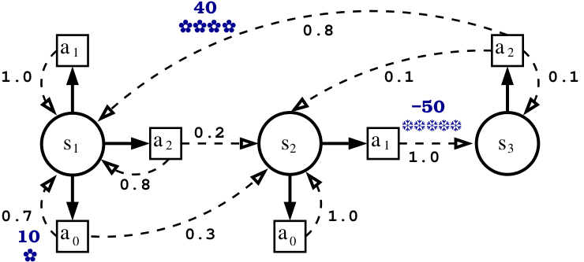

MDP Example 11
==============

Description
-----------

We want to implement the model of MDP proposed by A. Geron in the book
*Hands-On Machine Learning With Scikit-Learn and Tensorflow: Concepts, Tools, and Techniques to Build Intelligent Systems* (2017).

The MDP is given (Chapter 16 fig 16.8) by: 

|

 
|

As it can be seen, the number of actions is different in each state. We illustrate here the manner that gives matrices of same dimension for all the action.

| This done by adding an action in a state:
| the transition associated to this action jumps in the same state 
| the action is roughly penalized

| For example the action a2 should be added is s2:
| We add a transition from s2 to s2 in the matrix associated with the action a2 (later matrix P2)
| We penalize the entry associated to state s2 action a2 (coordinate (1,2) in the matrix Reward).

When the  discount factor is 0.95

* the optimal policy is [ 0, 2, 1 ] 
* the value function Value is [ 21.8992 1.17982 53.8735 ]

  
If you change the discount factor in 0.9  then 

* the optimal policy should be [0,0,2] 
* the value function should be [18.9189  0.0 50.1337]

Tasks performed
---------------

#. Create an MDP

    * create two ``MarmoteInterval`` objects to hold the state Space and the action space
    * create a ``vector<TransitionStructure*>`` a vector of transitionStructure which is the upperclass of ``SparseMatrix`` to store the transition matrices
    * create three ``SparseMatrix`` objects to hold the transition matrices associated with each of the two actions. They are defined entry by entry with the ``setEntry()`` function; 
    * create the ``DiscountedMDP``
    
#. solve the MDP with methods ``ValueIteration``, ``PolicyIterationModified`` and ``GaussSeidelValueIteration``
#. Check the obtained costs   
#. Clean up.

Code
----

We only illustrate here how we manage the creation of virtual event toward the same state. 

.. code-block:: c++

    SparseMatrix *P0 = new SparseMatrix(dim_SS); 
    /* matrix for the a0 action*/
    P0->setEntry(0,0,0.7);
    P0->setEntry(0,1,0.3);
    P0->setEntry(1,1,1.0);
    P0->setEntry(2,2,1.0); /* add virtual action */
    trans.at(0) = P0;

    /* matrix for the a1 action*/
    SparseMatrix *P1 = new SparseMatrix(dim_SS);
    P1->setEntry(0,0,1.0);
    P1->setEntry(1,2,1.0);
    P1->setEntry(2,2,1.0); /* add virtual action */
    trans.at(1) = P1;
    
    /* matrix for the a2 action*/
    SparseMatrix *P2 = new SparseMatrix(dim_SS);
    P2->setEntry(0,0,0.8);
    P2->setEntry(0,1,0.2);
    P2->setEntry(1,1,1.0); /* add virtual action */
    P2->setEntry(2,0,0.8);
    P2->setEntry(2,1,0.1);
    P2->setEntry(2,2,0.1);
    trans.at(2) = P2;

We also underline  that the transition with probability 0 should not be filled in. Indeed, the are not necessarily and take memory and computation time.
``SparseMatrix`` object manages this. 

This is the Reward matrix

.. code-block:: c++

    SparseMatrix *Reward  = new SparseMatrix(dim_SS);
    Reward->setEntry(0,0,7);
    Reward->setEntry(0,1,0.0); /* this must not done */
    Reward->setEntry(0,2,0.0); /* indeed null entries do not to have been filled in  */
    Reward->setEntry(1,0,0);   /* this is inefficient (supplementary computations are done) but this has no consequences */
    Reward->setEntry(1,1,-50);
    Reward->setEntry(1,2,penalty);
    Reward->setEntry(2,0,penalty);
    Reward->setEntry(2,1,penalty);
    Reward->setEntry(2,2,32);

 
Output
------

.. literalinclude:: ../media/exampleMDP11.res
    :language: text

Download
--------

The source file is :download:`here <../media/exampleMDP11.cpp>`

